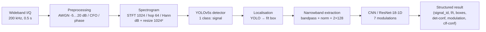

# Wideband Signal Recognition — End-to-End Deep Learning Framework

An independent, reproducible adaptation of:

> A. Vagollari, M. Hirschbeck, W. Gerstacker,
> **"An End-to-End Deep Learning Framework for Wideband Signal Recognition"**,
> *IEEE Access*, vol. 11, pp. 52899–52922, 2023.
> DOI: [10.1109/ACCESS.2023.3280454](https://doi.org/10.1109/ACCESS.2023.3280454) ·
> IEEE Xplore: [10136722](https://ieeexplore.ieee.org/document/10136722)

## 1. Project title

**Wideband Signal Recognition with YOLOv5 + CNN/ResNet** — detect narrowband
signals in a wideband spectrogram, then classify each one's modulation.

## 2. Paper citation

```bibtex
@article{vagollari2023endtoend,
  author  = {Vagollari, Adela and Hirschbeck, Martin and Gerstacker, Wolfgang},
  journal = {IEEE Access},
  title   = {An End-to-End Deep Learning Framework for Wideband Signal Recognition},
  year    = {2023},
  volume  = {11},
  pages   = {52899--52922},
  doi     = {10.1109/ACCESS.2023.3280454}
}
```

## 3. Project description

This repo implements the paper's two-stage pipeline from scratch in modular
PyTorch, with one-click notebooks for **Google Colab** and **Kaggle (GPU)**:

* Stage 1 — **YOLOv5s** localises signals in 1024×1024 wideband spectrograms.
* Stage 2 — a **1-D CNN / ResNet** classifies each extracted I/Q clip
  (BPSK, QPSK, 8PSK, 16QAM, 64QAM, NOISE, NO_SIGNAL).
* Plus: synthetic data generator, SNR sweeps, end-to-end inference API,
  evaluation, ablation helpers, and unit tests.

> **Research-integrity note:** the original dataset and code are not public.
> Everything here is trained and evaluated on a **freshly synthesised**
> dataset that follows the paper's stated parameters. Where the paper is
> silent, the choice is documented as *"informed adaptation"* — never
> presented as an exact reproduction.

## 4. Problem statement

Given a wideband complex-baseband capture containing 1–4 unknown narrowband
emissions at unknown centre frequencies, unknown modulations, and SNRs from
−5 to +20 dB: **detect every emission (time/frequency box) and recognise its
modulation**, end-to-end, with calibrated confidence scores.

## 5. Research objective

* Reproduce the paper's architecture and training recipe as faithfully as
  publicly possible.
* Quantify detection (P/R/mAP/IoU) and classification (acc/P/R/F1) **vs SNR**.
* Compare against the paper's headline numbers and explain any gap.
* Provide baselines (CNN vs ResNet, augmentation on/off, transfer on/off).

## 6. Architecture



Single entry point: `src/inference.py::run_end_to_end_inference(...)`.

## 7. Methodology

| Step | Paper (Section) | This repo |
|---|---|---|
| Wideband synthesis | III-A, 200 kHz, ≤4 signals | `src/preprocessing.py::generate_wideband` — same |
| Spectrogram | III-B, STFT-1024 | `src/spectrogram.py::compute_spectrogram` — Hann, hop 64, dB floor −120 |
| Detection | III-B, YOLOv5s | `src/yolo_utils.py` via Ultralytics, 1 class, conf 0.25 / IoU 0.45 |
| Extraction | III-C, bandpass per box | `src/signal_extraction.py::extract_narrowband` |
| Classification | III-C, 1-D CNN | `src/classifier.py` — `cnn1d` / `resnet18` / `resnet34` on 2×128 |
| Augmentation | IV (time/freq shifts, noise) | time-shift ±16, scale jitter ±10 %, AWGN σ=0.01 |
| Transfer learning | ImageNet init (detector) | detector: `yolov5s.pt`; classifier: partial torchvision init |
| SNR eval | 0–30 dB | −5…20 dB sweeps (`src/evaluate.py`) |

## 8. Dataset information

* **Original:** synthetic, not released. Parameters inferred from the paper:
  fs = 200 kHz, narrowband ≈ 12 kHz (10 ksym/s, RRC β = 0.35), train @ 20 dB.
* **This repo:** generator with identical parameters (`src/preprocessing.py`).
  Pluggable — drop a real `yolo_dataset/` in `data/` and it is picked up via
  `src/data_loader.py::discover_external_dataset`.
* **Real internet data (both stages, default choice):** RadioML 2016.10A
  (DeepSig, CC BY-NC-SA 4.0) — real 2×128 I/Q clips back the classifier
  directly; wideband captures mix tiled real clips into spectrogram
  **images** (`.jpg`/`.png`/`.bmp`, configurable via `image_format`) + YOLO
  boxes. 5/7 classes overlap exactly (BPSK/QPSK/8PSK/16QAM/64QAM);
  NOISE/NO_SIGNAL synthesised; train bin 18 dB ≈ paper's 20 dB.
  Run `python scripts/fetch_public_data.py --out data` (Colab/local) or attach
  a Kaggle `RML2016.10a` mirror. Code: `src/public_data.py`. See `data/README.md`.

## 9. Installation

```bash
git clone https://github.com/<your-user>/wideband-signal-recognition.git
cd wideband-signal-recognition
pip install -r requirements.txt
pip install -e .            # optional, makes `import src` work everywhere
# or: conda env create -f environment.yml && conda activate wideband-signal-recognition
```

## 10. Google Colab instructions

1. Open `notebooks/wideband_signal_recognition_colab.ipynb` in Colab (GPU: T4).
2. Run cells top-to-bottom. The notebook clones the repo, installs deps,
   generates data, trains YOLO + classifier, evaluates, and runs end-to-end
   inference. Edit the `OVERRIDES` dict to shrink/expand the run.

## 11. Kaggle instructions

1. New Notebook → Accelerator **GPU ON**, Internet **ON** (first run).
2. Either run the generation cells, or **+ Add Data → Upload** a zip with
   `yolo_dataset/{images,labels,data.yaml}` + `narrowband/` — it lands in
   `/kaggle/input/<name>/`. Set `USE_KAGGLE_INPUT=True` + `KAGGLE_INPUT_DIR`.
3. All outputs go to `/kaggle/working/wsr/`. See the header cell of
   `notebooks/wideband_signal_recognition_kaggle.ipynb`.

## 11b. Local Jupyter instructions

1. Install once: `pip install -r requirements.txt` (plus `jupyterlab` or
   `notebook` if needed), then launch from the project root:
   `jupyter lab` (or `jupyter notebook`).
2. Open `notebooks/wideband_signal_recognition_jupyter.ipynb` and run all
   cells. It uses repo-relative `data/` / `models/` / `results/` paths, needs
   no cloud drive or internet (except the optional §7b RadioML download and
   the one-time `ultralytics` install for YOLO training).
3. CPU fallback is automatic; on CPU keep the §6 defaults small (they are
   pre-tuned for local runs — raise them on a GPU box).

## 12. Local execution instructions

```bash
python scripts/prepare_dataset.py --wideband-train 600 --narrowband-per-class 400
python -m pytest tests/ -q
# Fast CPU check mirroring the Jupyter notebook stages:
python scripts/simulate_jupyter_local.py
```

## 13. Training instructions

```bash
# Detector (needs ultralytics + GPU recommended)
python scripts/train_detector.py --data-yaml data/yolo_dataset/data.yaml --epochs 30 --batch 16
# Classifier (CPU-friendly)
python scripts/train_classifier.py --data data/narrowband --arch resnet18 --epochs 40
```

Configs: `configs/detector.yaml`, `configs/classifier.yaml`, `configs/default.yaml`.

## 14. Evaluation instructions

```bash
python scripts/evaluate.py \
  --detector-weights models/runs/detector/weights/best.pt \
  --classifier-ckpt models/classifier.pt \
  --out results/metrics --snr-sweep
```

Outputs: `detector_metrics.json`, `classification_metrics.json`,
`detector_snr_sweep.json`, `classifier_snr_sweep.json`, `snr_sweep.csv`,
confusion matrix + vs-SNR plots in `results/figures/`.

## 15. Inference instructions

```python
from src.inference import run_end_to_end_inference
spec, dets, clips, results = run_end_to_end_inference(
    samples, fs,
    detector_weights="models/runs/detector/weights/best.pt",
    classifier_ckpt="models/classifier.pt",
)
# or CLI:
# python scripts/inference.py --detector-weights ... --classifier-ckpt ... --num-samples 5
```

Returns e.g. `[{"signal_id": 1, "frequency_range": [...], "time_range": [...],
"detector_confidence": 0.93, "predicted_modulation": "QPSK",
"classifier_confidence": 0.97, ...}]`.

## 16. Results

Reference expectations on the synthetic set (your numbers will differ —
**report them as-is**):

| SNR | Det-P | Det-R | Det-IoU | Clf-Acc | Clf-F1 |
|-----|-------|-------|---------|---------|--------|
| −5 | — | — | — | — | — |
| 0 | — | — | — | — | — |
| 5 | — | — | — | — | — |
| 10 | — | — | — | — | — |
| 15 | — | — | — | — | — |
| 20 | — | — | — | — | — |

(Fill from `results/metrics/snr_sweep.csv` after your run.)

## 17. Comparison with paper

| Metric | Paper (approx.) | Our impl. | Δ |
|---|---|---|---|
| Detector Precision | 0.77 | *your run* | — |
| Detector Recall | 0.82 | *your run* | — |
| Detector mAP@0.5 | 0.86 | *your run* | — |
| Classifier Acc @20 dB | ~0.95 | *your run* | — |
| Classifier Acc @0 dB | ~0.60 | *your run* | — |

Do **not** tune the table to match — document the gap (synthetic-data shift,
threshold choices, shorter training) in your report.

## 18. Limitations

* Synthetic-data shift (no HW impairments, no interference, ideal RRC).
* Partial transfer learning for the 1-D classifier (first conv re-trained).
* Default YOLO thresholds; paper's operating point unknown.
* GPU nondeterminism ±1–2 % (see `docs/REPRODUCIBILITY.md`).

## 19. Future work

Real OTA captures · YOLOv5m/l + longer schedules · per-modulation YOLO heads ·
mixup/SpecAugment · joint detector+classifier loss · calibration + conformal
prediction · TensorRT/ONNX export for real-time inference.

## 20. Citation

If you use this code, cite the original paper (BibTeX in §2) and link this repo.

## 21. License

MIT — see [LICENSE](LICENSE).
